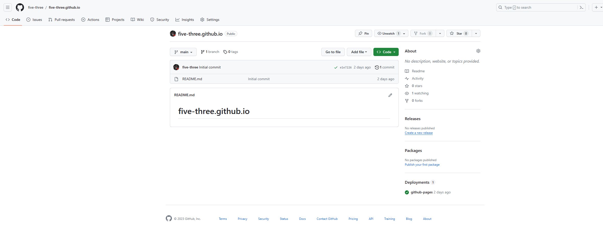
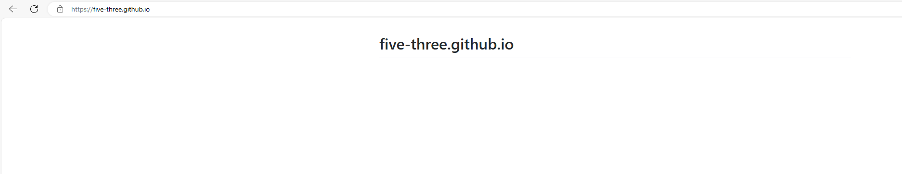
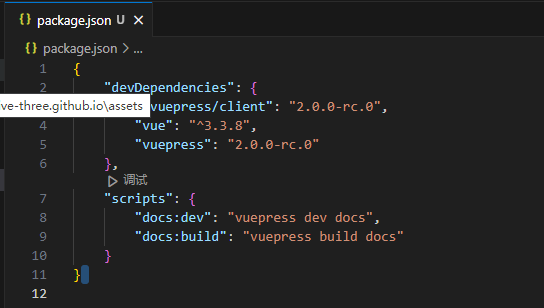

# Github博客搭建

> [VuePress | DailyNotes (ayusummer.github.io)](https://ayusummer.github.io/DailyNotes/NoteTools/VuePress.html)

首先按**用户名.github.io**的命名方式创建github仓库



github就会自动为你创建page博客了



用vscode将仓库拉取到本地

cmd切换目录到仓库目录

使用如下命令安装npnm：

```
npm install -g pnpm
```

使用如下命令安装vue和VuePress

```
pnpm add -D vue @vuepress/client@next
pnpm install -D vuepress@next
```

编辑package.json,添加以下配置：

```
{
  "scripts": {
    "docs:dev": "vuepress dev docs",
    "docs:build": "vuepress build docs"
  }
}
```



在仓库文件夹下新建.gitignore文件，该文件的目的是使git工具不同步该文件里所列出的文件

