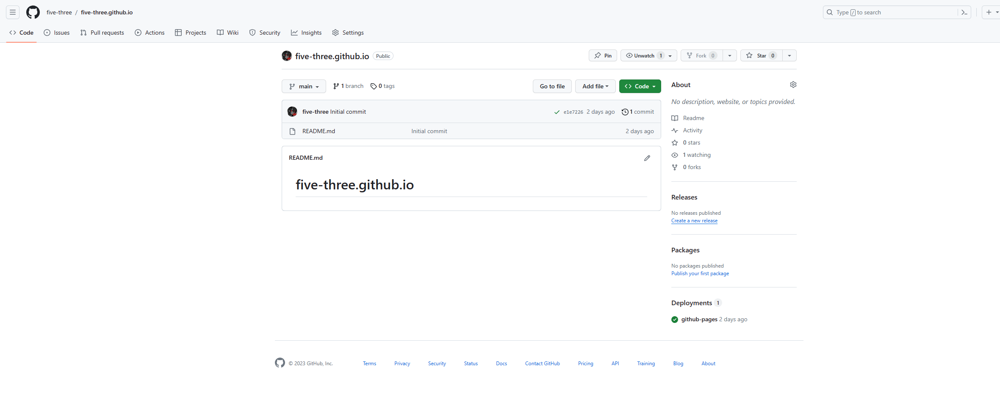

# Github博客搭建

> [VuePress | DailyNotes (ayusummer.github.io)](https://ayusummer.github.io/DailyNotes/NoteTools/VuePress.html)

本博客搭建参考了以上老兄的教程，采用了Vuepress+github page的方式进行搭建

首先按**用户名.github.io**的命名方式创建github仓库



github就会自动为你创建page博客了


用vscode将仓库拉取到本地

cmd切换目录到仓库目录

使用如下命令安装npnm：

```cmd
npm install -g pnpm
```

使用如下命令安装vue和VuePress

```
pnpm add -D vue @vuepress/client@next
pnpm install -D vuepress@next
```

编辑package.json,添加以下配置：

```json
{
  "scripts": {
    "docs:dev": "vuepress dev docs",
    "docs:build": "vuepress build docs"
  }
}
```


在仓库文件夹下新建.gitignore文件，该文件的目的是使git工具不同步该文件里所列出的文件

使用以下指令可以简单运行项目：

```cmd
pnpm run docs:dev
pnpm run dos:build
```

在docs/.vuepress目录下创建config.js:

```js
module.exports = {
    // 站点的标题
    title: "VuePressTest",
    // 站点的描述
    description: "This is a blog.",
    // 站点配置, 设置为 /[仓库名]/
    base: '/VuePressTest/',
}
```

如果像我这样直接将站点部署到仓库上而非子路径的话，base就不用特别设置，直接"/"就行

根目录下新建.github/workflows/docs.yml

填入如下内容：

```yml
name: docs

on:
  # 每当 push 到 main 分支时触发部署
  push:
    branches: [main]
  # 手动触发部署
  workflow_dispatch:

jobs:
  docs:
    runs-on: ubuntu-latest

    steps:
      - uses: actions/checkout@v4
        with:
          # “最近更新时间” 等 git 日志相关信息，需要拉取全部提交记录
          fetch-depth: 0

      - name: Setup pnpm
        uses: pnpm/action-setup@v2
        with:
          # 选择要使用的 pnpm 版本
          version: 8
          # 使用 pnpm 安装依赖
          run_install: true

      - name: Setup Node.js
        uses: actions/setup-node@v4
        with:
          # 选择要使用的 node 版本
          node-version: 18
          # 缓存 pnpm 依赖
          cache: pnpm

      # 运行构建脚本
      - name: Build VuePress site
        run: pnpm docs:build

      # 查看 workflow 的文档来获取更多信息
      # @see https://github.com/crazy-max/ghaction-github-pages
      - name: Deploy to GitHub Pages
        uses: crazy-max/ghaction-github-pages@v4
        with:
          # 部署到 gh-pages 分支
          target_branch: gh-pages
          # 部署目录为 VuePress 的默认输出目录
          build_dir: docs/.vuepress/dist
        env:
          # @see https://docs.github.com/cn/actions/reference/authentication-in-a-workflow#about-the-github_token-secret
          GITHUB_TOKEN: ${{ secrets.GITHUB_TOKEN }}
```

理论上提交并推送修改就会正常了，但是如果你是像我一样直接用vscode从github仓库拉取代码

可能会导致在actions这步通不过，报错：token未通过之类的，找了很久也没在网上找到解决方案，最后是发现token的默认premissions为只读，去设置页面改成读写权限就好了：


action成功执行完成后，去github的github pages调整设置如下：


保存，等待action执行完成后应该就能访问到个人网站了：


> Tips：网站主页默认为docs\index.md，如果没有创建该文件可能会显示404 not found

这样我们的网站雏形就搭建好了！

网站美化：

> [vuepress 网页背景-掘金 (juejin.cn)](https://juejin.cn/s/vuepress 网页背景)
