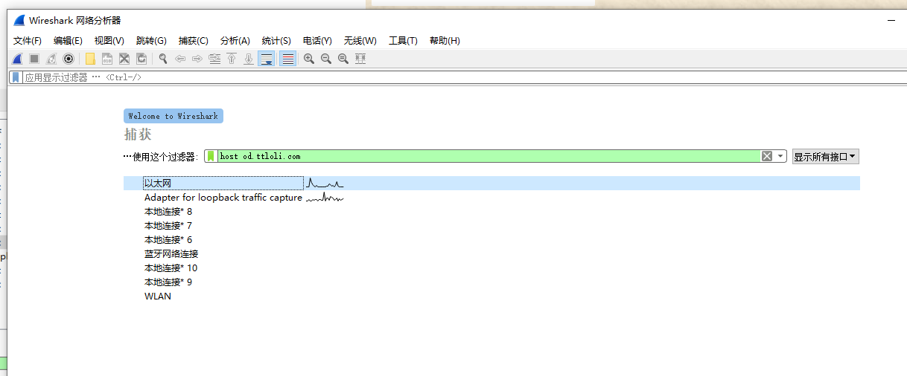
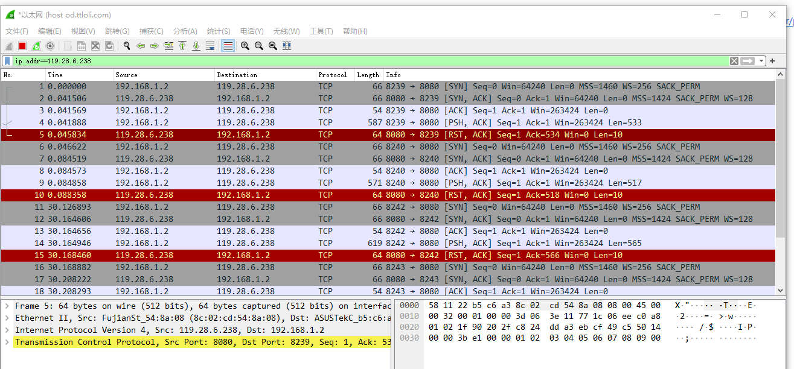

# wireshark常用语法


## 捕获过滤器

方向：

```
src dst
```

类型：

```
host port
```

协议：

```
ether arp ip tcp udp icmp
```

逻辑运算符：

```
 && || !
```

注意：没有==

使用例：



## 显示过滤器

比较操作符

```
== != > < >= <=
```

逻辑操作符

```
and or xor not
```

IP地址

```
ip.addr ip.src ip.dst
```

端口过滤

```
tcp.port tcp.srcport tcp.dstport tcp.flags.syn/ack
```

协议过滤

```
tcp ip icmp arp http dns dhcp
```

使用例


